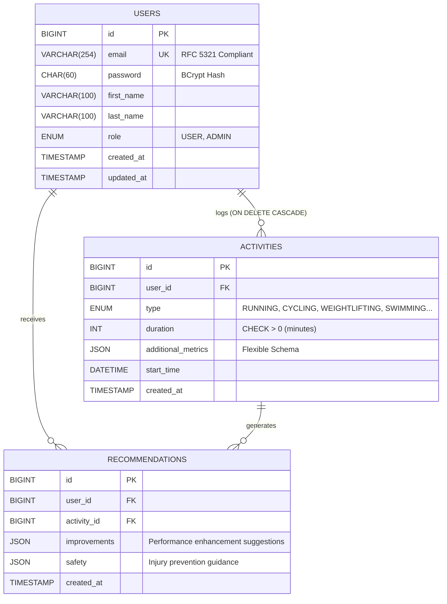

<div align="center">


### 🏋️ Enterprise-Grade Fitness Tracking Platform

A production-ready, stateless REST API engineered with senior-level backend architecture patterns. Features JWT authentication, role-based access control, dynamic workout tracking, and AI-powered fitness recommendations with strict data integrity and zero-tolerance security standards.

<p>
  
  
  
  
  
  
</p>

[](https://opensource.org/licenses/MIT)
[](https://github.com/shaikhmahad/fitness-tracker-backend)
[](https://github.com/shaikhmahad/fitness-tracker-backend)

</div>

---

## 📋 Table of Contents

- [Core Engineering Features](#-core-engineering-features)
- [Technology Stack](#-technology-stack)
- [System Architecture](#-system-architecture)
- [Entity Relationship Diagram](#️-entity-relationship-diagram)
- [API Endpoints](#-api-endpoints)
- [Security Architecture](#-security-architecture)
- [Quick Start Guide](#-quick-start-guide)
- [Configuration](#️-configuration)
- [Database Migrations](#-database-migrations)
- [Testing](#-testing)
- [Performance Optimization](#-performance-optimization)
- [Project Structure](#-project-structure)
- [Contributing](#-contributing)
- [License](#-license)

---

## ⚡ Core Engineering Features

This is **not** a basic CRUD application. It demonstrates **senior-level backend engineering** with enterprise-grade architectural patterns and best practices:

### 🔐 Security & Authentication
- **Stateless JWT Authentication:** Custom security filter chains using `io.jsonwebtoken` for horizontally scalable, session-less authentication
- **Role-Based Access Control (RBAC):** Fine-grained permission management with `USER` and `ADMIN` roles
- **BCrypt Password Hashing:** Industry-standard one-way encryption with 10 rounds of salting
- **CORS Configuration:** Production-ready cross-origin request handling
- **Global Exception Handling:** Centralized `@RestControllerAdvice` preventing sensitive error information leakage

### 🗄️ Database & Persistence
- **Strict Schema Control:** Hibernate DDL auto-generation **disabled** (`ddl-auto=validate`) for production safety
- **Flyway Migrations:** Version-controlled database evolution with rollback capabilities
- **Optimized Indexing:** Composite indexes on `(user_id, activity_id)` and unique constraints on email fields
- **Database-Level Constraints:** `CHECK` constraints ensuring data integrity at the storage layer
- **Connection Pooling:** HikariCP for high-performance database connection management

### 🎯 Architecture & Design Patterns
- **N-Tier Architecture:** Strict separation of concerns (Controller → Service → Repository → Entity)
- **DTO Pattern with MapStruct:** Compile-time code generation eliminating reflection overhead and preventing data leakage
- **Dependency Injection:** Constructor-based DI for immutability and testability
- **Repository Pattern:** Spring Data JPA interfaces with custom query methods
- **Transaction Management:** `@Transactional` boundaries ensuring ACID properties

### 🚀 Advanced Features
- **JSON Column Support:** `@JdbcTypeCode(SqlTypes.JSON)` for flexible, schema-less workout metrics storage
- **Pagination & Sorting:** `Pageable` support for efficient large dataset handling
- **Bean Validation:** JSR-303/380 annotations for declarative input validation
- **OpenAPI 3.0 Documentation:** Auto-generated interactive API documentation via Swagger UI
- **Custom Exception Hierarchy:** Business-specific exceptions (`ResourceNotFoundException`, `ResourceAlreadyExistsException`, etc.)

---

## 🛠️ Technology Stack

### Core Framework
| Technology | Version | Purpose |
|-----------|---------|---------|
| **Java** | 21 (LTS) | Primary programming language with virtual threads support |
| **Spring Boot** | 3.4.x | Application framework and dependency injection container |
| **Spring Security** | 6.x | Authentication, authorization, and security filters |
| **Spring Data JPA** | 3.x | Data access layer abstraction |
| **Hibernate** | 6.x | ORM and entity lifecycle management |

### Data & Persistence
| Technology | Version | Purpose |
|-----------|---------|---------|
| **MySQL** | 8.x | Primary relational database |
| **Flyway** | 10.x | Database version control and migrations |
| **HikariCP** | 5.x | JDBC connection pooling |

### Security & Authentication
| Technology | Version | Purpose |
|-----------|---------|---------|
| **jjwt-api** | 0.12.x | JWT token generation and validation |
| **BCrypt** | Built-in | Password hashing algorithm |

### Code Generation & Mapping
| Technology | Version | Purpose |
|-----------|---------|---------|
| **MapStruct** | 1.6.x | Compile-time DTO-Entity mapping |
| **Lombok** | 1.18.x | Boilerplate code reduction |

### Documentation & Validation
| Technology | Version | Purpose |
|-----------|---------|---------|
| **SpringDoc OpenAPI** | 2.x | API documentation and Swagger UI |
| **Jakarta Validation** | 3.x | Bean validation (JSR-380) |

### Build & Dependencies
| Technology | Version | Purpose |
|-----------|---------|---------|
| **Maven** | 3.9.x | Dependency management and build automation |
| **Maven Compiler Plugin** | 3.13.x | Java compilation with annotation processing |

---

## 🏗️ System Architecture

The application follows a **strict N-tier architecture** ensuring clean separation of concerns, high testability, and maintainability.

```text
┌─────────────────────────────────────────────────────────────────┐
│                        Client Layer                              │
│              (Web, Mobile, Third-party APIs)                     │
└────────────────────────┬────────────────────────────────────────┘
                         │ HTTP/HTTPS Requests
                         ▼
┌─────────────────────────────────────────────────────────────────┐
│                   Security Filter Chain                          │
│        (JWT Validation, CORS, CSRF Protection)                   │
└────────────────────────┬────────────────────────────────────────┘
                         │
                         ▼
┌─────────────────────────────────────────────────────────────────┐
│                     Controller Layer                             │
│    • HTTP Request Mapping (@RestController)                      │
│    • Input Validation (@Valid, @Validated)                       │
│    • Response Formatting                                         │
│    • Exception Handling Trigger                                  │
└────────────────────────┬────────────────────────────────────────┘
                         │ DTOs
                         ▼
┌─────────────────────────────────────────────────────────────────┐
│                      Service Layer                               │
│    • Business Logic Implementation                               │
│    • Transaction Management (@Transactional)                     │
│    • Entity ↔ DTO Mapping (MapStruct)                           │
│    • Complex Validations                                         │
└────────────────────────┬────────────────────────────────────────┘
                         │ Entities
                         ▼
┌─────────────────────────────────────────────────────────────────┐
│                    Repository Layer                              │
│    • Data Access Abstraction (Spring Data JPA)                   │
│    • Custom Queries (JPQL, Native SQL)                           │
│    • Pagination & Sorting                                        │
└────────────────────────┬────────────────────────────────────────┘
                         │ SQL Queries
                         ▼
┌─────────────────────────────────────────────────────────────────┐
│                      MySQL Database                              │
│    • Relational Data Storage                                     │
│    • Flyway Schema Migrations                                    │
│    • Constraints, Indexes, Triggers                              │
└─────────────────────────────────────────────────────────────────┘
```

### Layer Responsibilities

| Layer | Responsibilities | Technologies |
|-------|-----------------|--------------|
| **Controller** | Request routing, validation, response serialization | Spring Web, Jackson, Jakarta Validation |
| **Service** | Business logic, transactions, orchestration | Spring Core, MapStruct |
| **Repository** | Database queries, entity management | Spring Data JPA, Hibernate |
| **Entity** | Domain model, database mapping | JPA, Hibernate |

---

## 🗺️ Entity Relationship Diagram

The database schema is **normalized to 3NF** to enforce referential integrity, minimize data redundancy, and optimize query performance.



### Key Database Features

- **Composite Unique Constraint:** `(user_id, activity_id)` on recommendations table prevents duplicate AI-generated insights
- **Foreign Key Cascades:** `ON DELETE CASCADE` for activities ensures orphaned data is automatically cleaned
- **Check Constraints:** Database-level validation (e.g., `duration > 0`) as a second line of defense
- **Optimized Data Types:** `CHAR(60)` for BCrypt hashes, `VARCHAR(254)` for RFC 5321-compliant emails

---

## 📡 API Endpoints

Fully documented via **OpenAPI 3.0**. Once running, visit `http://localhost:8080/swagger-ui.html` for the interactive Swagger UI.

### Authentication Endpoints

| Method | Endpoint | Description | Request Body | Response | Access |
|--------|----------|-------------|--------------|----------|--------|
| `POST` | `/api/auth/register` | Register new user account | `RegisterUserDto` | `UserResponseDto` + JWT | Public |
| `POST` | `/api/auth/login` | Authenticate and receive JWT token | `LoginUserDto` | `LoginResponse` (JWT) | Public |

**Example Registration Request:**
```json
{
  "email": "john.doe@example.com",
  "password": "SecureP@ssw0rd",
  "firstName": "John",
  "lastName": "Doe"
}
```

**Example Login Response:**
```json
{
  "token": "eyJhbGciOiJIUzI1NiIsInR5cCI6IkpXVCJ9...",
  "expiresIn": 3600000
}
```

### User Management Endpoints

| Method | Endpoint | Description | Parameters | Response | Access |
|--------|----------|-------------|------------|----------|--------|
| `GET` | `/api/users/me` | Get current authenticated user | - | `UserResponseDto` | `USER`, `ADMIN` |
| `GET` | `/api/users/{id}` | Get user by ID | `id` (path) | `UserResponseDto` | `ADMIN` |
| `GET` | `/api/users` | List all users (paginated) | `page`, `size` | `Page<UserResponseDto>` | `ADMIN` |
| `PUT` | `/api/users/{id}` | Update user details | `id` (path), `UpdateUserDto` | `UserResponseDto` | `USER`, `ADMIN` |
| `DELETE` | `/api/users/{id}` | Delete user account | `id` (path) | `204 No Content` | `ADMIN` |

### Activity Tracking Endpoints

| Method | Endpoint | Description | Parameters | Response | Access |
|--------|----------|-------------|------------|----------|--------|
| `POST` | `/api/activities` | Log new fitness activity | `ActivityDto` | `ActivityResponseDto` | `USER`, `ADMIN` |
| `GET` | `/api/activities/user/{userId}` | Get user's activity history | `userId`, `page`, `size` | `Page<ActivityResponseDto>` | `USER`, `ADMIN` |
| `GET` | `/api/activities/{id}` | Get activity by ID | `id` (path) | `ActivityResponseDto` | `USER`, `ADMIN` |
| `PUT` | `/api/activities/{id}` | Update activity details | `id` (path), `ActivityDto` | `ActivityResponseDto` | `USER`, `ADMIN` |
| `DELETE` | `/api/activities/{id}` | Delete activity log | `id` (path) | `204 No Content` | `USER`, `ADMIN` |

**Example Activity Request:**
```json
{
  "type": "RUNNING",
  "duration": 45,
  "startTime": "2024-03-15T06:30:00Z",
  "additionalMetrics": {
    "distance": 8.5,
    "averagePace": "5:17",
    "heartRate": 165,
    "calories": 520
  }
}
```

### Recommendation Endpoints

| Method | Endpoint | Description | Parameters | Response | Access |
|--------|----------|-------------|------------|----------|--------|
| `POST` | `/api/recommendations` | Generate AI-powered fitness recommendations | `RecommendationDto` | `RecommendationResponseDto` | `ADMIN` |
| `GET` | `/api/recommendations/activity/{activityId}` | Get recommendations for specific activity | `activityId` (path) | `RecommendationResponseDto` | `USER`, `ADMIN` |
| `GET` | `/api/recommendations/user/{userId}` | Get all user recommendations | `userId` (path) | `List<RecommendationResponseDto>` | `USER`, `ADMIN` |

---

## 🔒 Security Architecture

### JWT Token Flow

```text
1. User Registration/Login
   ├─→ Password hashed with BCrypt (10 rounds)
   ├─→ JWT generated with HS256 algorithm
   └─→ Token contains: { userId, email, role, exp }

2. Authenticated Request
   ├─→ Client sends: Authorization: Bearer <token>
   ├─→ JwtAuthenticationFilter validates token
   ├─→ SecurityContext populated with user details
   └─→ @PreAuthorize checks role permissions

3. Token Expiration
   ├─→ Default expiry: 24 hours
   ├─→ Refresh mechanism: Re-authenticate
   └─→ Invalid tokens return 401 Unauthorized
```

### Security Features

| Feature | Implementation | Benefits |
|---------|---------------|----------|
| **Password Hashing** | BCrypt with strength 10 | Resistant to rainbow table attacks |
| **JWT Signing** | HMAC-SHA256 | Tamper-proof tokens |
| **CORS** | Configurable origins | Prevents unauthorized cross-origin requests |
| **CSRF Protection** | Stateless (disabled for APIs) | JWT-based authentication doesn't require CSRF tokens |
| **SQL Injection** | Parameterized queries (JPA) | Prevents malicious SQL execution |
| **Role-Based Access** | `@PreAuthorize` annotations | Fine-grained endpoint protection |

---

## 🚀 Quick Start Guide

### Prerequisites

| Requirement | Version | Download |
|------------|---------|----------|
| **JDK** | 21+ | [Oracle JDK](https://www.oracle.com/java/technologies/downloads/) or [OpenJDK](https://adoptium.net/) |
| **Maven** | 3.9+ | [Apache Maven](https://maven.apache.org/download.cgi) |
| **MySQL** | 8.0+ | [MySQL Community Server](https://dev.mysql.com/downloads/mysql/) |
| **Git** | Latest | [Git Downloads](https://git-scm.com/downloads) |

### Installation Steps

#### 1️⃣ Clone Repository
```bash
git clone https://github.com/shaikhmahad/fitness-tracker-backend.git
cd fitness-tracker-backend
```

#### 2️⃣ Database Configuration
Create the database:
```sql
CREATE DATABASE fitness_tracker CHARACTER SET utf8mb4 COLLATE utf8mb4_unicode_ci;
```

Create `application-local.yml` in `src/main/resources/`:
```yaml
spring:
  datasource:
    url: jdbc:mysql://localhost:3306/fitness_tracker?useSSL=false&serverTimezone=UTC
    username: your_mysql_username
    password: your_mysql_password
    driver-class-name: com.mysql.cj.jdbc.Driver

  jpa:
    hibernate:
      ddl-auto: validate  # NEVER use 'update' or 'create-drop' in production
    show-sql: true
    properties:
      hibernate:
        format_sql: true
        dialect: org.hibernate.dialect.MySQL8Dialect

  flyway:
    enabled: true
    baseline-on-migrate: true

security:
  jwt:
    secret-key: your-256-bit-secret-key-change-this-in-production
    expiration: 86400000  # 24 hours in milliseconds
```

> **Security Warning:** Never commit `application-local.yml` to version control. Add it to `.gitignore`.

#### 3️⃣ Environment Variables (Recommended for Production)
```bash
export DB_URL="jdbc:mysql://localhost:3306/fitness_tracker"
export DB_USERNAME="your_username"
export DB_PASSWORD="your_password"
export JWT_SECRET="your-secure-secret-key-min-256-bits"
export JWT_EXPIRATION="86400000"
```

#### 4️⃣ Build Project
MapStruct requires compilation to generate mapper implementations:
```bash
mvn clean install
```

#### 5️⃣ Run Application
```bash
mvn spring-boot:run
```

Or run the JAR directly:
```bash
java -jar target/fitness-tracker-backend-1.0.0.jar
```

#### 6️⃣ Verify Installation
Once started, visit:
- **Swagger UI:** http://localhost:8080/swagger-ui.html
- **API Docs JSON:** http://localhost:8080/v3/api-docs
- **Health Check:** http://localhost:8080/actuator/health

You should see:
```json
{
  "status": "UP"
}
```

---

## ⚙️ Configuration

### Application Profiles

| Profile | Purpose | Activation |
|---------|---------|------------|
| `default` | Development | Active by default |
| `prod` | Production | `--spring.profiles.active=prod` |
| `test` | Integration Testing | Automatically activated during tests |

### Key Configuration Properties

```yaml
# Server Configuration
server:
  port: 8080
  servlet:
    context-path: /

# Security
security:
  jwt:
    secret-key: ${JWT_SECRET:default-secret-for-dev-only}
    expiration: ${JWT_EXPIRATION:86400000}

# Database Connection Pooling (HikariCP)
spring:
  datasource:
    hikari:
      maximum-pool-size: 10
      minimum-idle: 5
      connection-timeout: 30000
      idle-timeout: 600000
      max-lifetime: 1800000

# Flyway Migration
spring:
  flyway:
    enabled: true
    baseline-on-migrate: true
    validate-on-migrate: true

# Logging
logging:
  level:
    root: INFO
    dev.shaikhmahad.fitness: DEBUG
    org.hibernate.SQL: DEBUG
```

---

## 🗃️ Database Migrations

Flyway manages all schema changes with version-controlled SQL scripts located in `src/main/resources/db/migration/`.

### Migration Files

| File | Description | Execution Order |
|------|-------------|-----------------|
| `V1__init.sql` | Initial schema creation (users, activities, recommendations) | 1 |
| `V2__add_missing_recommendation_fields.sql` | Adds JSON columns for improvements and safety tips | 2 |

### Running Migrations Manually

```bash
# Validate migrations
mvn flyway:validate

# View migration status
mvn flyway:info

# Execute pending migrations
mvn flyway:migrate

# Rollback (requires Flyway Teams edition)
mvn flyway:undo
```

### Migration Best Practices

✅ **DO:**
- Use descriptive filenames: `V{version}__{description}.sql`
- Test migrations on a copy of production data
- Keep migrations idempotent where possible
- Version control all migration scripts

❌ **DON'T:**
- Modify existing migration files after deployment
- Use Hibernate's `ddl-auto=update` in production
- Store sensitive data in migration scripts

---

## 🧪 Testing

### Running Tests

```bash
# Run all tests
mvn test

# Run with coverage report
mvn test jacoco:report

# Run specific test class
mvn test -Dtest=UserServiceImplTest

# Run integration tests only
mvn verify -P integration-tests
```

### Test Structure

```text
src/test/java/dev/shaikhmahad/fitness/
├── controllers/    # Controller layer tests (MockMvc)
├── services/       # Service layer tests (Mockito)
├── repositories/   # Repository tests (DataJpaTest)
└── integration/    # End-to-end integration tests
```

---

## ⚡ Performance Optimization

### Database Optimization

- **Composite Indexes:** `(user_id, activity_id)` for recommendation lookups
- **Connection Pooling:** HikariCP with optimized pool sizes
- **Query Optimization:** N+1 query prevention with `@EntityGraph`
- **Pagination:** All list endpoints return `Page<T>` to limit result sets

### Application Performance

- **DTO Mapping:** Compile-time MapStruct (zero reflection overhead)
- **Lazy Loading:** Strategic use of `FetchType.LAZY` for collections
- **Caching:** Spring Cache abstraction ready for Redis integration
- **Async Processing:** `@Async` support for non-blocking operations

---

## 📁 Project Structure

```text
fitness-tracker-backend/
│
├── src/main/java/dev/shaikhmahad/fitness/
│   ├── config/
│   │   ├── ApplicationConfiguration.java      # Bean definitions
│   │   ├── JwtAuthenticationFilter.java       # JWT validation filter
│   │   └── SecurityConfiguration.java         # Security chains
│   │
│   ├── controllers/
│   │   ├── AuthenticationController.java      # /api/auth/*
│   │   ├── UserController.java                # /api/users/*
│   │   ├── ActivityController.java            # /api/activities/*
│   │   └── RecommendationController.java      # /api/recommendations/*
│   │
│   ├── dto/
│   │   ├── request/                           # Inbound DTOs
│   │   │   ├── RegisterUserDto.java
│   │   │   ├── LoginUserDto.java
│   │   │   └── ActivityDto.java
│   │   └── response/                          # Outbound DTOs
│   │       ├── UserResponseDto.java
│   │       └── ActivityResponseDto.java
│   │
│   ├── entities/
│   │   ├── User.java                          # JPA entity
│   │   ├── Activity.java
│   │   └── Recommendation.java
│   │
│   ├── enums/
│   │   ├── UserRole.java                      # USER, ADMIN
│   │   └── ActivityType.java                  # RUNNING, CYCLING, etc.
│   │
│   ├── exceptions/
│   │   ├── GlobalExceptionHandler.java        # @RestControllerAdvice
│   │   ├── ResourceNotFoundException.java
│   │   └── ResourceAlreadyExistsException.java
│   │
│   ├── mappers/
│   │   ├── UserMapper.java                    # MapStruct interface
│   │   └── ActivityMapper.java
│   │
│   ├── repositories/
│   │   ├── UserRepository.java                # Spring Data JPA
│   │   ├── ActivityRepository.java
│   │   └── RecommendationRepository.java
│   │
│   ├── services/
│   │   ├── AuthenticationService.java
│   │   ├── JwtService.java
│   │   ├── UserService.java
│   │   └── impl/                              # Service implementations
│   │       ├── UserServiceImpl.java
│   │       └── ActivityServiceImpl.java
│   │
│   └── FitnessTrackerApplication.java         # Spring Boot entry point
│
├── src/main/resources/
│   ├── db/migration/                          # Flyway SQL scripts
│   │   ├── V1__init.sql
│   │   └── V2__add_missing_recommendation_fields.sql
│   ├── application.yml                        # Main configuration
│   └── application-prod.yml                   # Production overrides
│
├── src/test/java/                             # Unit & integration tests
├── pom.xml                                    # Maven dependencies
└── README.md                                  # This file
```

## 🤝 Contributing

Contributions are welcome! Please follow these guidelines:

### How to Contribute

1. **Fork the repository**
2. **Create a feature branch**
   ```bash
   git checkout -b feature/amazing-feature
   ```
3. **Make your changes** following the coding standards
4. **Write tests** for new functionality
5. **Commit with conventional commits**
   ```bash
   git commit -m "feat: add amazing feature"
   ```
6. **Push to your fork**
   ```bash
   git push origin feature/amazing-feature
   ```
7. **Open a Pull Request**

### Coding Standards

- Follow Java naming conventions
- Use meaningful variable/method names
- Write JavaDoc for public methods
- Maintain test coverage above 80%
- Use Lombok to reduce boilerplate
- Follow SOLID principles

### Commit Message Convention

```text
feat: Add new feature
fix: Bug fix
docs: Documentation changes
style: Code formatting
refactor: Code restructuring
test: Add tests
chore: Build/config changes
```

---

## 📄 License

This project is licensed under the **MIT License**.

```
MIT License

Copyright (c) 2024 Shaikh Mahad

Permission is hereby granted, free of charge, to any person obtaining a copy
of this software and associated documentation files (the "Software"), to deal
in the Software without restriction, including without limitation the rights
to use, copy, modify, merge, publish, distribute, sublicense, and/or sell
copies of the Software, and to permit persons to whom the Software is
furnished to do so, subject to the following conditions:

The above copyright notice and this permission notice shall be included in all
copies or substantial portions of the Software.

THE SOFTWARE IS PROVIDED "AS IS", WITHOUT WARRANTY OF ANY KIND, EXPRESS OR
IMPLIED, INCLUDING BUT NOT LIMITED TO THE WARRANTIES OF MERCHANTABILITY,
FITNESS FOR A PARTICULAR PURPOSE AND NONINFRINGEMENT. IN NO EVENT SHALL THE
AUTHORS OR COPYRIGHT HOLDERS BE LIABLE FOR ANY CLAIM, DAMAGES OR OTHER
LIABILITY, WHETHER IN AN ACTION OF CONTRACT, TORT OR OTHERWISE, ARISING FROM,
OUT OF OR IN CONNECTION WITH THE SOFTWARE OR THE USE OR OTHER DEALINGS IN THE
SOFTWARE.
```

---

## 🙏 Acknowledgments

- **Spring Team** - For the excellent Spring Framework and Spring Boot
- **Hibernate Team** - For robust ORM capabilities
- **MapStruct Contributors** - For compile-time DTO mapping
- **Flyway** - For database version control
- **JWT.io** - For JWT implementation resources

---

## 📞 Support & Contact

<div align="center">

### 👨‍💻 Built & Maintained By

**Shaikh Mahad**
Backend Engineer | Java & Spring Boot Specialist

<a href="https://shaikhmahad.vercel.app">
  
</a>
<a href="https://www.linkedin.com/in/codewithmahad">
  
</a>
<a href="https://github.com/shaikhmahad">
  
</a>

### 💬 Get In Touch

Have questions or suggestions? Feel free to reach out!

📧 **Email:** [contact@shaikhmahad.dev](mailto:contact@shaikhmahad.dev)
💼 **LinkedIn:** [linkedin.com/in/codewithmahad](https://www.linkedin.com/in/codewithmahad)
🌐 **Portfolio:** [shaikhmahad.vercel.app](https://shaikhmahad.vercel.app)

---

### ⭐ Star This Repository

If you found this project helpful or learned something new, please consider giving it a ⭐!

[](https://github.com/shaikhmahad/fitness-tracker-backend/stargazers)
[](https://github.com/shaikhmahad/fitness-tracker-backend/network/members)

---


</div>